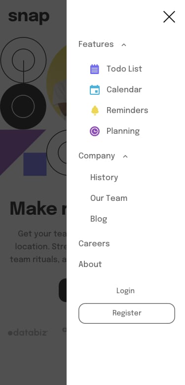

# Intro section with dropdown navigation solution

This is a solution to the [Intro section with dropdown navigation challenge on Frontend Mentor](https://www.frontendmentor.io/challenges/intro-section-with-dropdown-navigation-ryaPetHE5). .

## Table of contents

- [Overview](#overview)
  - [The challenge](#the-challenge)
  - [Screenshot](#screenshot)
  - [Links](#links)
- [My process](#my-process)
  - [Built with](#built-with)
  - [What I learned](#what-i-learned)
  - [Continued development](#continued-development)
  - [Useful resources](#useful-resources)
- [Author](#author)
- [Acknowledgments](#acknowledgments)


## Overview

### The challenge

Users should be able to:

- View the relevant dropdown menus on desktop and mobile when interacting with the navigation links
- View the optimal layout for the content depending on their device's screen size
- See hover states for all interactive elements on the page

### Screenshot




### Links

- Solution URL: [Add solution URL here](https://your-solution-url.com)
- Live Site URL: [Add live site URL here](https://your-live-site-url.com)

## My process
no process just keep going when you get stuck.
### Built with

- Semantic HTML5 markup
- CSS custom properties
- Flexbox
- CSS Grid
- Mobile-first workflow
- [React](https://reactjs.org/) - JS library
- [Next.js](https://nextjs.org/) - React framework
- [Styled Components](https://styled-components.com/) - For styles
- [Modern css reset](https://piccalil.li/blog/a-modern-css-reset/) - piccalil

### What I learned


```html
<div class="main-menu">
                    <button id ="close-menu-botton" class="close-menu-botton"></button>
                    <ul>
                        <li>
                            <a href="#" id="features-button" area="false"><div>Features</div></a>
                            <div id="drop-down-one" class="drop-down-menu | drop-down-one" style="display:none;">
                                <ul>
                                    <li><a href="#"> List</a></li>
                                    <li><a href="#">Calendar</a></li>
                                    <li><a href="#">Reminders</a></li>
                                    <li><a href="#">Planning</a></li>
                                </ul>
                            </div>
                        </li>
                        <li>
                            <a href="#" id="company-button" area="open">Company</a>
                            <div id="drop-down-two" class="drop-down-menu | drop-down-two" style="display:none;">
                                <ul>
                                    <li><a href="#">History</a></li>
                                    <li><a href="#">Our Team</a></li>
                                    <li><a href="#">Blog</a></li>
                                </ul>
                            </div>
                        </li>
                        <li><a href="#">Careers</a></li>
                        <li><a href="#">About</a></li>
                    </ul>
                </div>
```
```css
@media (hover: hover) {
        /* hover things */

    .learn-more-button{
        border: 2px solid transparent;
    }
        .login-desktop:hover {
            color: var(--neutral-300);
        }
        .register-desktop:hover{
            border: .15em solid var(--neutral-300);
            color: var(--neutral-300)
        }
        .main-container-menu ul li a:hover {
            color: var(--neutral-300);
        }
        .learn-more-button:hover{
            background-color: var(--neutral-100);
            color: var(--neutral-300);
            border: 2px solid var(--neutral-200);
        }

}
```
```js

// variable for desktop
const features = document.getElementById("features-button");
const company = document.getElementById("company-button");
const drpDownOne = document.getElementById("drop-down-one");
const drpDownTwo = document.getElementById("drop-down-two");

// variable for mobile
const menuBtn = document.getElementById("menu-botton");
const closeBtn = document.getElementById("close-menu-botton");
const menuContainer = document.getElementById("main-container-menu");
const imgCloseOpenMenuOneDown = document.getElementById("close-open-img1-down");
const imgCloseOpenMenuOneUp = document.getElementById("close-open-img1-up");
const imgCloseOpenMenuTwoUp = document.getElementById("close-open-img2-up");
const imgCloseOpenMenuTwoDown = document.getElementById("close-open-img2-down");
// var width = window.matchMedia("(min-width: 600px)")

// function for dekstop
features.addEventListener('click',function() {
    const test = features.getAttribute('area');
    if (test=='false'){
        drpDownOne.style.display = 'block';
        features.setAttribute('area','true');

        imgCloseOpenMenuOneDown.style.display='none';
        imgCloseOpenMenuOneUp.style.display='block';
        imgCloseOpenMenuTwoDown.style.display='block';
        imgCloseOpenMenuTwoUp.style.display='none';

        drpDownTwo.style.display = 'none';
        company.setAttribute('area','false');

    } else {
        imgCloseOpenMenuOneDown.style.display='block';
        imgCloseOpenMenuOneUp.style.display='none';

        drpDownOne.style.display = 'none';
        features.setAttribute('area','false');
    }
});
company.addEventListener('click',function() {
    const test = company.getAttribute('area');
    if (test=='false'){
        drpDownTwo.style.display = 'block';
        company.setAttribute('area','true');

        imgCloseOpenMenuTwoDown.style.display='none';
        imgCloseOpenMenuTwoUp.style.display='block';
        imgCloseOpenMenuOneDown.style.display='block';
        imgCloseOpenMenuOneUp.style.display='none';

        drpDownOne.style.display = 'none';
        features.setAttribute('area','false');

    } else {
        imgCloseOpenMenuTwoDown.style.display='block';
        imgCloseOpenMenuTwoUp.style.display='none';
        drpDownTwo.style.display = 'none';
        company.setAttribute('area','false');
    }
});
window.addEventListener('click', function(e){
    if (!features.contains(e.target) & !company.contains(e.target)){
        drpDownOne.style.display = 'none';
        features.setAttribute('area','false');
        drpDownTwo.style.display = 'none';
        company.setAttribute('area','false');

        imgCloseOpenMenuTwoDown.style.display='block';
        imgCloseOpenMenuTwoUp.style.display='none';
        imgCloseOpenMenuOneDown.style.display='block';
        imgCloseOpenMenuOneUp.style.display='none';
    }
  });

// functions for mobile
menuBtn.addEventListener('click', function() {
    menuContainer.style.display='block';
})
closeBtn.addEventListener('click', function() {
    menuContainer.style.display='none';
})
window.addEventListener('click',function(e){
    if (!menuContainer.contains(e.target) & !menuBtn.contains(e.target)){
        menuContainer.style.display='none';

        imgCloseOpenMenuTwoDown.style.display='block';
        imgCloseOpenMenuTwoUp.style.display='none';
        imgCloseOpenMenuOneDown.style.display='block';
        imgCloseOpenMenuOneUp.style.display='none';
    }
})

```

### Continued development

My first project with menu, Im so glad for finishing this work. Specialy the mobile version with the side menu on the right.


### Useful resources

- [W3schools](https://www.w3schools.com/) - This helped me for javaScript eventListener. I really liked this pattern and will use it going forward.
- [stackoverflow](https://stackoverflow.com/) - this website help me on the javascript when i get stock.
## Author

- Website - [Mohamed Sagou](https://github.com/medsagou)
- Frontend Mentor - [@medsagou](https://www.frontendmentor.io/profile/medsagou)
- Twitter - [@sagoumohamed](https://www.twitter.com/sagoumohamed)

## Acknowledgments

nothing for this project.
